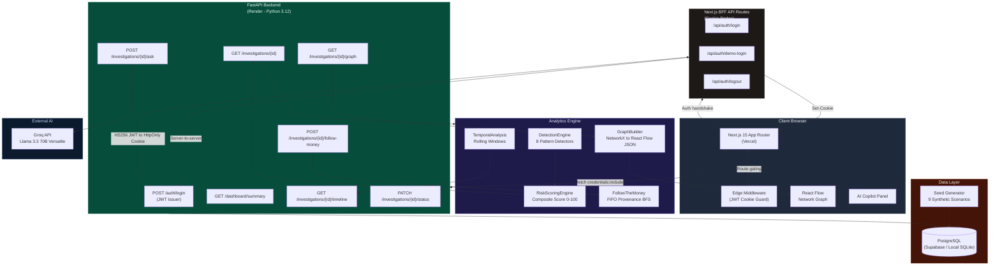
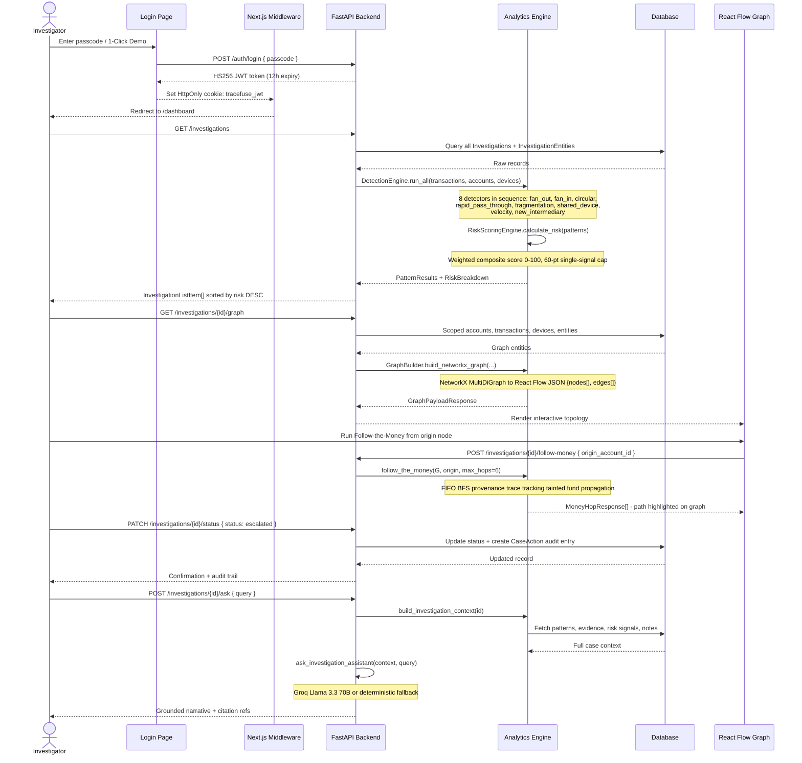

<div align="center">

# 🔎 TraceFuse

**Financial Crime & Forensic Pattern Detection Console**

[](https://tracefuse.vercel.app)
[](https://render.com)
[](https://fastapi.tiangolo.com)
[](https://nextjs.org)
[](https://python.org)
[](https://buildbank.in)
[](LICENSE)

> **TraceFuse** transforms raw transaction logs into live, explorable crime syndicate maps — turning weeks of manual audit work into a 60-second visual investigation.

</div>

---

## 🎯 Overview

Financial crime does not happen in isolated transactions. It unfolds across networks — layered intermediaries, shared hardware, coordinated mule accounts, and circular fund movements engineered to evade binary alert systems.

**TraceFuse** is a full-stack AML (Anti-Money Laundering) investigation cockpit that models an entire financial ecosystem — accounts, persons, devices, merchants, beneficiaries, and UPI/NEFT transactions — as a **live, interactive, explorable graph**. Instead of classifying single transactions, TraceFuse detects complex multi-hop syndicate structures over time and presents them in a human-centric dossier that any investigator or regulator can act on immediately.

> *Built for **Problem Statement 5**: "Tracing Financial Crime Across Patterns" — Build Bank Hackathon 2026, Track 2: Fraud Detection & Financial Crime Prevention.*

### What It Detects

| Pattern | Description |
|---|---|
| **Fan-Out Networks** | Burst fund distributions from a single origin to many mules |
| **Fan-In Aggregation** | Multiple feeders consolidating into one collection account |
| **Layered Pass-Through Chains** | Rapid multi-hop laundering through transient intermediaries |
| **Circular Fund Movement** | Closed-loop cycles returning funds to the syndicate origin |
| **Shared-Device Mule Rings** | Accounts linked via common hardware/device fingerprints |
| **Transaction Fragmentation** | Structuring transfers below alert thresholds (smurfing) |
| **Velocity Burst Anomalies** | Abnormal transaction frequency spikes in rolling time windows |
| **New Intermediary Injection** | Sudden appearance of never-before-seen accounts in a chain |

Every finding is **deterministic, explainable, and traceable** back to specific transaction IDs and timestamps — with no black-box ML guesswork.

---

## ✨ Key Features

- **Investigation Dossier** — Rich case view with composite risk score breakdown, pattern evidence cards, investigator case notes, status lifecycle management (`New → Investigating → Escalated → Resolved`), and one-click compliance report generation (SAR/STR-ready).

- **Interactive React Flow Network Graph** — Live, zoomable, pannable force graph rendering every account, entity, device, and UPI transaction as a node/edge network. Nodes carry full metadata; edge labels show transaction amounts; custom node types (`account`, `person`, `merchant`, `device`) with distinct visual styles and correct z-index layering.

- **Follow-the-Money Trace** — FIFO provenance trace that tracks tainted funds hop-by-hop from any origin account, showing exact amounts, timestamps, and the complete propagation path through the syndicate.

- **Transaction Timeline** — Chronological event stream pinpointing burst windows, pattern trigger moments, and anomaly clusters with IST-formatted timestamps.

- **AI Investigation Copilot** — Context-grounded assistant (`POST /investigations/{id}/ask`) that answers natural-language queries about the case: pattern explanations, SAR summary drafts, shared-device ring analysis, and money trail narration. Includes a full deterministic fallback engine so investigations are never blocked by AI API availability.

- **Operations Dashboard** — Live command center with aggregate metrics (total cases, critical risk count, total financial exposure in INR), risk distribution charts (Recharts BarChart + PieChart), and a searchable, filterable, sortable investigation queue ranked by composite risk score.

- **Cross-Origin JWT Authentication** — Dual-layer security: Next.js Edge Middleware gates all UI routes via `HttpOnly` cookie; FastAPI independently verifies HS256 JWT signature on every data endpoint. Handles cross-domain production deployments (Vercel + Render) via `SameSite=None; Secure=True` cookies with a graceful 401 redirect loop guard.

- **1-Click Judge Access** — Dedicated demo fast-track that authenticates and drops judges directly into the Flagship Investigation case graph in under 60 seconds.

- **Light / Dark Theme** — Full theme support with persistent toggle, custom CSS design tokens, and a warm linen/navy palette.

---

## 🏗️ System Architecture



---

## 🔄 Investigation Data Flow



---

## 🛠️ Tech Stack

### Frontend

| Technology | Purpose |
|---|---|
| **Next.js 15** (App Router) | Full-stack React framework, SSR, Edge Middleware route guards |
| **React 19** | Component model, concurrent rendering |
| **TypeScript** | End-to-end type safety with shared monorepo types |
| **Tailwind CSS** | Utility-first styling with custom design tokens |
| **React Flow (`@xyflow/react`)** | Interactive node/edge network graph canvas |
| **Recharts** | Dashboard metric charts (BarChart, PieChart) |
| **Lucide React** | Consistent iconography system |
| **`@tracefuse/shared`** | Internal workspace package — shared TS interfaces mirroring API schemas |

### Backend

| Technology | Purpose |
|---|---|
| **FastAPI** | High-performance async Python API, auto OpenAPI/ReDoc docs |
| **SQLAlchemy 2.0** | ORM with 12-table relational model and composite indexes |
| **Pydantic v2** | Request/response schema validation and serialization |
| **NetworkX** | Graph construction, BFS/DFS algorithms, centrality analysis |
| **PyJWT** | HS256 JWT issuance and `verify_session_token` dependency |
| **Groq SDK** | AI Copilot with `llama-3.3-70b-versatile` inference |
| **Pandas** | Temporal analysis, rolling window aggregation |
| **Faker (en_IN)** | Deterministic synthetic dataset generation (seed=42) |
| **Pytest + HTTPX** | 54-test unit, integration and acceptance test suite |

### Infrastructure

| Technology | Purpose |
|---|---|
| **Vercel** | Frontend deployment with automatic CI/CD from Git |
| **Render** | Backend Python web service with `render.yaml` |
| **Supabase / PostgreSQL** | Production relational database |
| **SQLite** | Zero-config local development fallback |
| **Docker + Procfile** | Containerized deployment for alternative targets |

---

## 🚀 Quick Start

### Prerequisites

- **Node.js** v20+
- **Python** 3.11 or 3.12
- **pip** and **Git**

### 1 — Clone

```bash
git clone https://github.com/harshsingh2275/Tracefuse.git
cd Tracefuse
```

### 2 — Configure Environment

```bash
cp .env.example .env
```

Edit `.env`:

```env
# Database (SQLite works locally with no extra setup)
DATABASE_URL=sqlite:///./tracefuse.db

# AI Copilot - optional, get a free key at https://console.groq.com
# A full deterministic fallback is included if this key is absent.
AI_API_KEY=your_groq_api_key_here
AI_MODEL=llama-3.3-70b-versatile
AI_BASE_URL=https://api.groq.com/openai/v1

# Auth
JWT_SECRET=your-strong-random-secret-min-32-chars
DEMO_PASSCODE=demo2026
COOKIE_SECURE=false        # Set true in production (HTTPS only)

# Frontend
NEXT_PUBLIC_API_URL=http://localhost:8000
ENVIRONMENT=development
```

Create `apps/web/.env.local`:

```env
NEXT_PUBLIC_API_URL=http://localhost:8000
```

### 3 — Backend

```bash
pip install -r requirements.txt
python -m data.seed.generate_seed_data
uvicorn apps.api.main:app --host 127.0.0.1 --port 8000 --reload
```

API docs available at: **`http://localhost:8000/docs`**

### 4 — Frontend

```bash
npm install
npm run dev
```

Investigation Cockpit at: **`http://localhost:3000`**

### 5 — Tests

```bash
pytest -v
```

---

## 🗂️ Monorepo Structure

```
Tracefuse/
├── apps/
│   ├── web/                          # Next.js 15 frontend
│   │   └── src/
│   │       ├── app/
│   │       │   ├── dashboard/        # Operations command center
│   │       │   ├── investigations/
│   │       │   │   ├── page.tsx      # Case list with search & filter
│   │       │   │   └── [id]/         # Case dossier (graph, timeline, evidence)
│   │       │   ├── login/            # Auth gate (passcode + demo 1-click)
│   │       │   └── api/auth/         # Next.js BFF cookie bridge
│   │       ├── components/
│   │       │   ├── graph/            # React Flow: custom nodes, edges, FollowMoney
│   │       │   ├── ai/               # AI Copilot panel
│   │       │   └── timeline/         # Transaction timeline component
│   │       ├── lib/
│   │       │   ├── api.ts            # Typed frontend API client
│   │       │   └── formatters.ts     # Case codes, currency, IST datetime helpers
│   │       └── middleware.ts         # JWT cookie Edge Middleware (route guard)
│   └── api/                          # FastAPI modular monolith
│       ├── main.py                   # App bootstrap, CORS, global error handler
│       ├── models.py                 # SQLAlchemy ORM models (12 tables)
│       ├── schemas.py                # Pydantic v2 request/response schemas
│       ├── auth.py                   # JWT issuance & verify_session_token
│       └── routers/                  # Feature routers (auth, dashboard, investigations)
├── analytics/                        # Core detection & scoring library
│   ├── graph/
│   │   ├── builder.py                # NetworkX graph construction to React Flow JSON
│   │   └── algorithms.py            # BFS/DFS Follow-the-Money, centrality metrics
│   ├── patterns/
│   │   ├── engine.py                 # DetectionEngine orchestrator
│   │   └── detectors/                # 8 independent rule-based detectors
│   ├── risk/scorer.py               # Composite risk scoring engine [0-100]
│   └── temporal/analysis.py         # Rolling window and burst spike detection
├── packages/shared/                  # Shared TypeScript types (monorepo package)
├── data/seed/                        # 9-scenario synthetic dataset generator (seed=42)
├── tests/                            # 54 pytest tests (unit + integration + acceptance)
├── docs/                             # Architecture, flow maps, decisions log
├── vercel.json                       # Vercel frontend deployment config
├── render.yaml                       # Render backend deployment config
└── requirements.txt                  # Python dependencies
```

---

## 🔒 Demo Access

| Method | Details |
|---|---|
| **Standard Login** | Navigate to `/login`, enter passcode: `demo2026` |
| **1-Click Judge Access** | Click **"Load Demo Investigation (1-Click Judge Access)"** on the login page |

> The 1-Click path authenticates instantly and loads the **Flagship Syndicate Case** — a complex Rs 8.4L multi-pattern investigation combining Fan-Out, Shared-Device Mule Ring, Circular Kickback, and 2-hop Rapid Layering — with the React Flow graph pre-rendered.

---

## 🧪 Test Suite

```bash
pytest -v   # 54 tests, all passing
```

| Suite | Coverage |
|---|---|
| Pattern Detectors | All 8 detectors (fan_out, fan_in, circular, pass-through, device, fragmentation, velocity, intermediary) |
| Risk Scoring | Composite [0-100] with 60-pt single-signal cap |
| Follow-the-Money | FIFO BFS multi-hop provenance trace |
| Seed Scenarios | All 9 synthetic cases (benign + fraudulent) |
| API Endpoints | All 13 FastAPI routes |
| Acceptance Audit | Full Section 27 criteria validation |

---

## 🌐 Production Deployment

### Frontend → Vercel

1. Connect repo to [Vercel](https://vercel.com)
2. **Build Command:** `npm --workspace=apps/web run build`
3. **Output Directory:** `apps/web/.next`
4. **Env var:** `NEXT_PUBLIC_API_URL=https://your-backend.onrender.com`

### Backend → Render

1. Connect repo to [Render](https://render.com)
2. Import `render.yaml` — pre-configured Python web service
3. Set secrets: `DATABASE_URL`, `JWT_SECRET`, `AI_API_KEY`, `CORS_ORIGINS`
4. After first deploy: `python -m data.seed.generate_seed_data`

Full walkthrough: [`docs/deployment-guide.md`](docs/deployment-guide.md)

---

## 🏆 Hackathon

<div align="center">

**Build Bank Hackathon 2026**

Youth Economy Lab (YEL) · IGDTUW Chapter

**Track 2:** Fraud Detection & Financial Crime Prevention

**Problem Statement 5:** *"Tracing Financial Crime Across Patterns"*

</div>

> TraceFuse was engineered as a complete, production-quality system — not a demo prototype. It features real cross-origin JWT authentication, a fully deterministic synthetic dataset covering 9 forensically distinct fraud scenarios, 8 independent explainable pattern detectors, a live interactive graph canvas, and a 54-test suite validating every acceptance criterion. All data is 100% synthetic — no real customer information is used anywhere.

---

## 📄 License

This project is licensed under the **MIT License**. See [`LICENSE`](LICENSE) for details.

---

<div align="center">
  <sub>Built with care and forensic precision · TraceFuse © 2026</sub>
</div>
